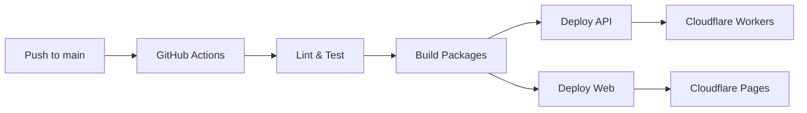

# 🚀 Deployment Documentation

Your GitHub Actions workflow is **ready to deploy**! This document links to all setup guides.

---

## ✅ What's Already Done

- ✅ GitHub Actions workflow configured (`.github/workflows/deploy.yml`)
- ✅ Secure deployment using GitHub Secrets
- ✅ Cloudflare API token verified and active
- ✅ Multi-environment support (production, staging, preview)
- ✅ Safe for public repositories (no secrets exposed)
- ✅ Automatic deployments on push

---

## 📚 Documentation Files

### Quick Start (Start Here)
**[.github/ADD_SECRETS.md](./.github/ADD_SECRETS.md)** - Step-by-step guide to add GitHub secrets (5 minutes)

### Complete Guides
- **[DEPLOYMENT_GUIDE.md](./DEPLOYMENT_GUIDE.md)** - Complete deployment guide with all steps
- **[DEPLOYMENT_SETUP.md](./DEPLOYMENT_SETUP.md)** - Detailed setup instructions
- **[.github/SECRETS_CHECKLIST.md](./.github/SECRETS_CHECKLIST.md)** - Quick checklist

---

## ⚡ Quick Setup (3 Steps)

### 1. Add GitHub Secrets

Go to: https://github.com/anti-detect/anti-detect.com/settings/secrets/actions

Add these secrets:
- `CLOUDFLARE_ACCOUNT_ID` - Get from Cloudflare Dashboard
- `CLOUDFLARE_API_TOKEN` - Get from Cloudflare Dashboard → My Profile → API Tokens

**[Detailed Instructions →](./.github/ADD_SECRETS.md)**

### 2. Set Up Cloudflare Resources

```bash
# Create D1 database
wrangler d1 create anti-detect

# Create KV namespaces
wrangler kv:namespace create IP_CACHE
wrangler kv:namespace create JA3_DB
wrangler kv:namespace create RATE_LIMITS

# Create R2 bucket
wrangler r2 bucket create anti-detect-reports

# Update apps/api/wrangler.toml with the IDs
```

### 3. Deploy

```bash
git push origin main
```

Watch deployment: https://github.com/anti-detect/anti-detect.com/actions

---

## 🔄 How Automatic Deployment Works



### Deployment Triggers

| Action | Result | URL |
|--------|--------|-----|
| Push to `main` | Deploy to production | https://anti-detect.com |
| Push to `staging` | Deploy to staging | https://staging.anti-detect.com |
| Open Pull Request | Create preview deployment | Auto-generated |

---

## 🔒 Security Features

✅ **All secrets stored in GitHub Secrets** (never in code)
✅ **Encrypted at rest and in transit**
✅ **No credentials exposed in logs**
✅ **Safe for public repositories**
✅ **Audit trail in GitHub Actions**
✅ **Token verified and active**

---

## 📋 Workflow Jobs

### 1. Lint & Test
- Runs on every push and PR
- Lints code with ESLint
- Type checks with TypeScript
- Runs unit tests (optional)

### 2. Deploy API
- Builds all dependencies
- Deploys to Cloudflare Workers
- Production: https://api.anti-detect.com
- Staging: https://api-staging.anti-detect.com

### 3. Deploy Web
- Builds Next.js application
- Optimizes for Cloudflare Pages
- Deploys static assets
- Production: https://anti-detect.com
- Staging: https://staging.anti-detect.com

### 4. Deploy Preview
- Creates preview for every PR
- Unique URL for each PR
- Automatic comment with preview link

---

## 🛠️ Local Development

```bash
# Install dependencies
pnpm install

# Start all apps in development mode
pnpm dev

# Build for production
pnpm build

# Lint code
pnpm lint

# Type check
pnpm typecheck
```

---

## 📊 Monitoring & Logs

### View Deployments
- **GitHub Actions:** https://github.com/anti-detect/anti-detect.com/actions
- **Cloudflare Dashboard:** https://dash.cloudflare.com

### View Logs
```bash
# API logs (production)
wrangler tail anti-detect-api

# API logs (staging)
wrangler tail anti-detect-api-staging
```

---

## 🐛 Troubleshooting

### Deployment Fails

1. Check GitHub Actions logs for errors
2. Verify all secrets are added correctly
3. Ensure Cloudflare resources exist
4. Check wrangler.toml configuration

### Common Issues

| Issue | Solution |
|-------|----------|
| Secret not found | Verify secret name matches exactly |
| Build fails | Test locally with `pnpm build` |
| API deploy fails | Check Cloudflare resources (D1, KV, R2) |
| Token invalid | Verify token in Cloudflare dashboard |

**[Full Troubleshooting Guide →](./DEPLOYMENT_GUIDE.md#-monitoring--debugging)**

---

## 📦 Project Structure

```
Anti-detect/
├── .github/
│   ├── workflows/
│   │   └── deploy.yml          # ✅ GitHub Actions workflow
│   ├── ADD_SECRETS.md          # Quick guide for adding secrets
│   └── SECRETS_CHECKLIST.md    # Setup checklist
├── apps/
│   ├── api/                    # Hono API (Cloudflare Workers)
│   └── web/                    # Next.js app (Cloudflare Pages)
├── packages/                   # Shared packages
├── DEPLOYMENT_GUIDE.md         # Complete deployment guide
├── DEPLOYMENT_SETUP.md         # Detailed setup guide
└── README_DEPLOYMENT.md        # This file
```

---

## ⚠️ Important Notes

1. **Never commit secrets** to git
2. **This repo will be public** - secrets must stay in GitHub Settings
3. **Rotate tokens periodically** for security
4. **Enable branch protection** for the main branch (recommended)
5. **Review PRs carefully** before merging

---

## 🎯 Next Steps

After deployment:

- [ ] Verify site is live
- [ ] Test API endpoints
- [ ] Set up custom domain (if needed)
- [ ] Configure Cloudflare Turnstile
- [ ] Enable Cloudflare Analytics
- [ ] Set up monitoring and alerts
- [ ] Configure SSL/TLS settings
- [ ] Enable CDN caching

---

## 📞 Support

- **GitHub Actions:** Check the Actions tab for logs
- **Cloudflare:** Check the dashboard for deployment status
- **Documentation:** Read the guides linked above

---

**Status:** ✅ Ready to Deploy

Your deployment workflow is fully configured and your Cloudflare API token is verified. Just add the secrets to GitHub and push your code!

**Cloudflare Token:** ✅ Verified and Active
**Workflow:** ✅ Configured
**Security:** ✅ GitHub Secrets
**Deployment:** ✅ Automatic
